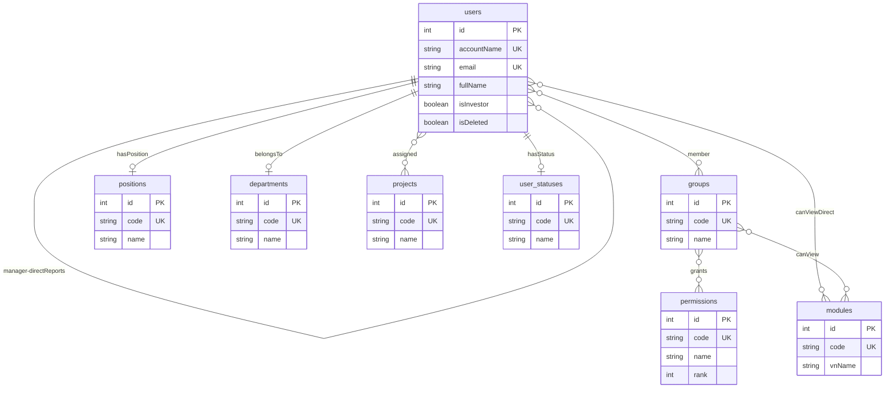
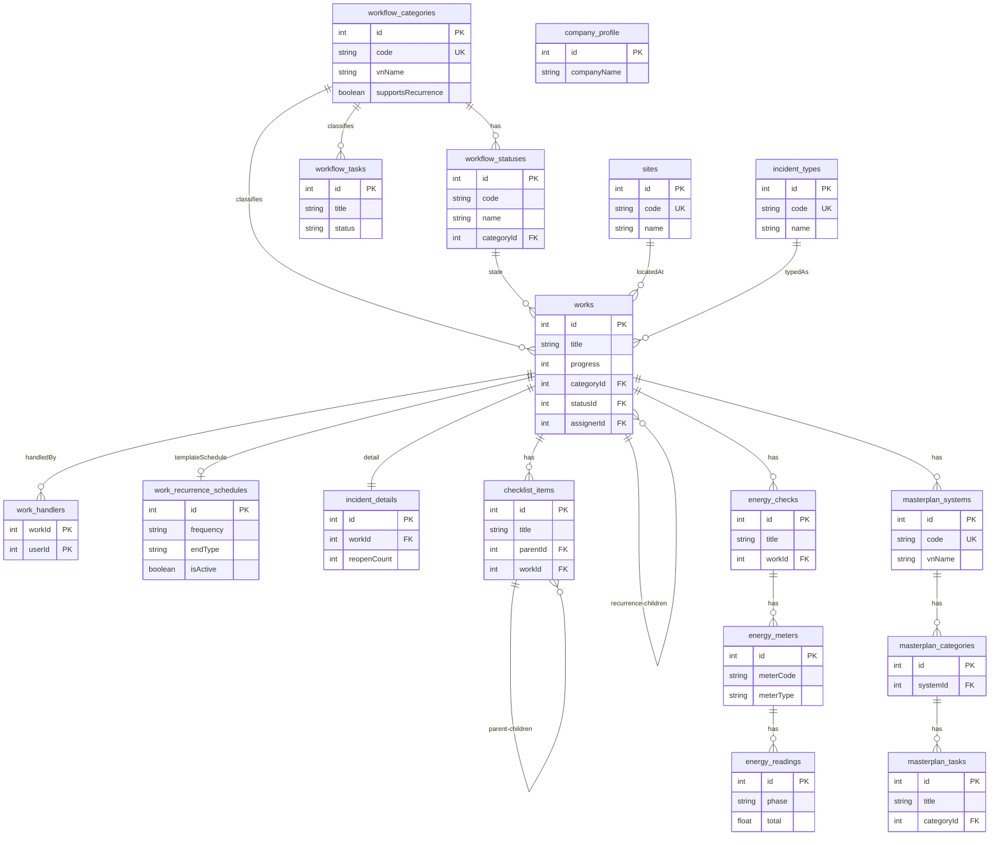

# Sơ đồ DB EMD (dựng lại từ Prisma — thay cho file drawio)

> Nguồn: `backend/prisma/schema.prisma` + `backend/prisma/seed.ts` + 3 file constants.
> Ngày dựng lại: 22/09/2026.
> Repo hiện **không có file `.drawio` nào** nên file này viết lại toàn bộ DB thành chữ + sơ đồ Mermaid để bạn review thiếu gì thì thêm.
> Xem hình: VSCode cần extension Mermaid Preview / Markdown Preview Mermaid, GitHub render tự động. Muốn đưa sang draw.io: https://app.diagrams.net/ → Arrange → Insert → Advanced → Mermaid → paste từng khối bên dưới (đã chia 2 sơ đồ nhỏ cho khỏi lỗi).

## 1. Tổng quan

- **25 model chính** (Prisma) → ~25 bảng Postgres + **6 bảng nối M2M ẩn** do Prisma tự sinh.
- DB: PostgreSQL, snake_case ở DB (`@map`), camelCase ở code.
- Quy ước chung mọi bảng:
  - `id Int @id autoincrement`
  - `uuid String @unique @default(uuid())` — chỉ các bảng nghiệp vụ lớn (users/groups/modules/workflow/works... không có ở droplist stub).
  - `isDeleted Boolean @default(false)` — **xoá mềm toàn hệ thống**, query mặc định lọc `isDeleted=false`.
  - `createdAt / updatedAt` — trừ 4 bảng droplist stub (`positions`, `departments`, `projects`, `user_statuses`) hiện **chưa có** 2 field này.
  - `code String? @unique` — mã droplist / mã loại việc, admin điền sau qua API.

### 1.1 Nhóm bảng

| Nhóm | Bảng | Ghi chú |
|------|------|---------|
| IAM core | `users`, `groups`, `permissions`, `modules` | RBAC theo group, rank quyền |
| Droplist user | `positions`, `departments`, `projects`, `user_statuses` | Bảng stub `{id, code, name}` — **thiếu field, xem mục 6** |
| Workflow khung | `workflow_categories`, `workflow_statuses`, `workflow_tasks`, `company_profile` | 5 loại việc + bộ status riêng từng loại |
| Work mở rộng | `works`, `work_handlers`, `work_recurrence_schedules`, `work_status_histories` | ~1000 việc/ngày, người thực hiện M2M, lịch lặp, timeline trạng thái |
| Sự cố | `incident_details`, `incident_types`, `sites` | 1-1 với work + 2 droplist, FK vị trí/tài sản |
| Tài sản | `assets`, `site_locations`, `asset_categories`, `asset_units`, `asset_usage_statuses`, `asset_conditions` | tài sản → vị trí (cây) → site; 4 droplist |
| Checklist | `checklist_items` | Cây cha-con tự tham chiếu |
| Năng lượng | `energy_checks`, `energy_meters`, `energy_readings` | 3 tầng: đợt → đồng hồ → chỉ số pha |
| Masterplan | `masterplan_systems`, `masterplan_categories`, `masterplan_tasks` | 3 cấp, `planData` JSON |
| Bảng nối ẩn | `_GroupToUser`, `_ProjectToUser`, `_ModuleToUser (viewerUsers)`, `_ModuleToGroup (viewerGroups)`, `_GroupToPermission`, `_WorkToUser (followers)` | Prisma implicit M2M, không có model riêng |

## 2. Sơ đồ ER (Mermaid — đã chia 2 hình cho khỏi lỗi render)

### 2.1 Hình A — IAM: người, nhóm, quyền, phân hệ



> Ghi chú: `users.coDepartmentId` cũng trỏ về `departments` (đồng đơn vị, chung 1 bảng) — gộp chung vào mũi tên `belongsTo` để Mermaid khỏi báo trùng quan hệ. Chi tiết xem bảng mục 2.3 dòng 3-4.

### 2.2 Hình B — Workflow và Works mở rộng



> `company_profile` đứng riêng (bảng singleton, không FK tới ai). `workflow_tasks.assigner-assignee` và `works.assigner-handlers-followers` đều trỏ về `users` — xem bảng mục 2.3 để đủ 3 mũi tên (gộp bớt trong hình cho gọn).

## 2.3 Bảng mối liên hệ đầy đủ (FK nào → bảng nào, quan hệ, onDelete)

> Đây là bảng bạn yêu cầu thêm. Đọc bảng này là thấy hết dây nối trong drawio.

### A. Nhóm IAM

| # | Từ bảng.cột | → Tới bảng.cột | Kiểu quan hệ | onDelete | Ghi chú |
|---|-------------|----------------|--------------|----------|---------|
| 1 | users.managerId | → users.id | N-1 (nhiều nhân viên — 1 quản lý), ngược lại `directReports` 1-N | SetNull | self-FK, xoá quản lý thì nhân viên mất link |
| 2 | users.positionId | → positions.id | N-1 | SetNull | chức vụ |
| 3 | users.departmentId | → departments.id | N-1 | SetNull | đơn vị chính |
| 4 | users.coDepartmentId | → departments.id | N-1 (FK thứ 2 cùng bảng) | SetNull | đồng đơn vị — chung 1 bảng departments |
| 5 | users.statusId | → user_statuses.id | N-1 | SetNull | tình trạng |
| 6 | users ↔ groups | M2M (bảng nối ẩn `_GroupToUser`) | N-N | Cascade hai đầu | 1 người nhiều nhóm, 1 nhóm nhiều người — **nguồn quyền duy nhất** |
| 7 | users ↔ projects | M2M (bảng nối ẩn) | N-N | Cascade | droplist dự án nhiều chọn |
| 8 | users ↔ modules.viewerUsers | M2M (bảng nối ẩn) | N-N | Cascade | user được xem phân hệ trực tiếp |
| 9 | groups ↔ permissions | M2M (bảng nối ẩn) | N-N | Cascade | group gắn nhiều quyền |
| 10 | groups ↔ modules.viewerGroups | M2M (bảng nối ẩn) | N-N | Cascade | group được xem phân hệ → member ké quyền xem |
| 11 | positions/departments/projects/user_statuses → users | 1-N ngược | — | — | mỗi droplist có nhiều user dùng |

### B. Workflow khung

| # | Từ bảng.cột | → Tới bảng.cột | Kiểu quan hệ | onDelete | Ghi chú |
|---|-------------|----------------|--------------|----------|---------|
| 12 | workflow_statuses.categoryId | → workflow_categories.id | N-1 | Cascade | mỗi loại 1 list status; xoá loại → xoá cả bộ status |
| 13 | workflow_tasks.categoryId | → workflow_categories.id | N-1 | Restrict | không cho xoá loại còn task |
| 14 | workflow_tasks.assignerId | → users.id | N-1 | Restrict | người giao = user đăng nhập |
| 15 | workflow_tasks.assigneeId | → users.id | N-1 (nullable) | SetNull | người thực hiện duy nhất (bản cũ) |
| 16 | works.categoryId | → workflow_categories.id | N-1 | Restrict | lọc việc theo loại |
| 17 | works.statusId | → workflow_statuses.id | N-1 (nullable) | SetNull | status phải thuộc đúng loại (API check) |
| 18 | (company_profile) | — | singleton, không FK | — | chỉ 1 bản ghi id=1, giữ bằng code |

### C. Works trung tâm + lịch lặp + người tham gia

| # | Từ bảng.cột | → Tới bảng.cột | Kiểu quan hệ | onDelete | Ghi chú |
|---|-------------|----------------|--------------|----------|---------|
| 19 | works.assignerId | → users.id | N-1 | Restrict | người giao duy nhất |
| 20 | work_handlers.(workId, userId) | → works.id + users.id | N-N tường minh, PK kép | Cascade cả 2 | người thực hiện nhiều người, index riêng `userId` |
| 21 | users ↔ works.followers | M2M (bảng nối ẩn) | N-N | Cascade | người theo dõi |
| 22 | works.recurrenceScheduleId | → work_recurrence_schedules.id | 1-1 (UNIQUE) | SetNull | mẫu ↔ schedule; tắt cờ mẫu thì xoá schedule |
| 23 | works.recurrenceId | → works.id (self) | N-1, ngược `children` 1-N | SetNull | work con sinh từ mẫu nào + `scheduledDate`; UNIQUE(recurrenceId, scheduledDate) chống sinh đôi |
| 24 | works.siteId | → sites.id | N-1 (nullable) | SetNull | thuộc site nào |
| 25 | works.incidentTypeId | → incident_types.id | N-1 (nullable) | SetNull | phân loại sự cố |
| 25b | work_status_histories.workId | → works.id | N-1 | Cascade | timeline trạng thái |
| 25c | work_status_histories.from/toStatusId | → workflow_statuses.id | N-1 (nullable) | SetNull | trước/sau (null = lúc tạo) |
| 25d | work_status_histories.changedById | → users.id | N-1 | Restrict | ai đổi |

### D. Sự cố / Checklist / Năng lượng / Masterplan

| # | Từ bảng.cột | → Tới bảng.cột | Kiểu quan hệ | onDelete | Ghi chú |
|---|-------------|----------------|--------------|----------|---------|
| 26 | incident_details.workId | → works.id | 1-1 (UNIQUE) | Cascade | xoá work → xoá chi tiết sự cố |
| 27 | checklist_items.parentId | → checklist_items.id (self) | N-1, ngược `children` 1-N | Cascade | cây cha-con; DELETE/RESTORE cascade cả cây |
| 28 | checklist_items.workId | → works.id (nullable) | N-1 | Cascade | con phải cùng work với cha |
| 29 | energy_checks.workId | → works.id (nullable) | N-1 | Cascade | đợt kiểm tra của work |
| 30 | energy_meters.checkId | → energy_checks.id | N-1 | Cascade | đồng hồ thuộc đợt |
| 31 | energy_readings.meterId | → energy_meters.id | N-1 | Cascade | chỉ số pha thuộc đồng hồ |
| 32 | masterplan_systems.workId | → works.id (nullable) | N-1 | Cascade | masterplan của work |
| 33 | masterplan_categories.systemId | → masterplan_systems.id | N-1 | Cascade | L2 thuộc L1; xoá system cascade cả cây |
| 34 | masterplan_tasks.categoryId | → masterplan_categories.id | N-1 | Cascade | L3 thuộc L2 |

## 3. Chi tiết từng bảng

### 3.1 `users` — Người dùng (nhân viên + chủ đầu tư chung 1 bảng)

| Cột | Kiểu | Ràng buộc | Ghi chú |
|-----|------|-----------|---------|
| id | Int | PK autoincrement | |
| accountName | String | UNIQUE | login được bằng accountName **hoặc** email |
| email | String | UNIQUE | |
| password | String | | bcrypt(password + PASSWORD_PEPPER) |
| fullName | String? | | |
| gender | MALE/FEMALE/OTHER? | enum `Gender` | |
| birthday | Date? | | |
| address | String? | | text tự do |
| internalPhone | String? | | số nội bộ |
| phone | String? | | |
| hireDate | Date? | | ngày vào làm |
| userLevel | Int? | | chưa có bảng level riêng |
| avatarPath / signaturePath | String? | | path file, chưa có bảng files |
| isDeleted | Boolean | default false | xoá mềm |
| isInvestor | Boolean | default false | false=nhân viên, true=chủ đầu tư (FE chia 2 tab) |
| refreshTokenHash | String? | | null = đã logout; chỉ lưu **1 token** — không đa thiết bị |
| positionId → positions | Int? | FK SetNull | chức vụ |
| departmentId → departments | Int? | FK SetNull | đơn vị |
| coDepartmentId → departments | Int? | FK SetNull | **đồng đơn vị, chung 1 bảng departments** |
| statusId → user_statuses | Int? | FK SetNull | tình trạng |
| managerId → users | Int? | self-FK SetNull | quản lý trực tiếp |
| projects | M2M | bảng nối ẩn | droplist nhiều chọn |
| groups | M2M | bảng nối ẩn | **nguồn quyền duy nhất**: user → group → permission |
| viewableModules | M2M → modules | bảng nối ẩn | phân hệ được xem trực tiếp |
| assignedTasks / executedTasks | 1-N → workflow_tasks | | task cũ (mục 3.3) |
| assignedWorks / handledWorks / followedWorks | 1-N / M2M → works | | work mới |
| createdAt / updatedAt | DateTime | | |

### 3.2 IAM: `groups`, `permissions`, `modules`

**`groups`**: id, uuid UNIQUE, code UNIQUE?, name, image?, isDeleted + M2M users + M2M permissions + M2M viewableModules. API CRUD + restore. Seed: `ADMINISTRATORS` gắn quyền ADMIN.

**`permissions`**: id, code UNIQUE, name, description?, rank default 0, isDeleted. Seed 7 quyền (rank): ADMIN 100 > CEO 90 > HO 80 > PROJECT_MANAGER 70 > TECHNICIAN 60 > SECURITY_GUARD 50 > INVESTOR 10. Guard nạp quyền từ group mỗi request, không cache.

**`modules`**: id, uuid, code UNIQUE?, image?, vnName, engName, isDeleted + M2M viewerUsers (users) + M2M viewerGroups (groups). Seed 8 module: WORKFLOW, APPLICATIONS, REPORTS, ASSETS, SYSTEM_ADMIN, APP_CONFIG, INTERNAL_CHAT, INVESTOR_PORTAL (group admin xem tất cả).

### 3.3 Droplist stub của user (4 bảng — đang sơ sài nhất)

| Bảng | Cột hiện có | Thiếu (xem mục 6) |
|------|-------------|-------------------|
| `positions` | id, code UNIQUE?, name, isDeleted | mô tả, rank/cấp, phòng ban mặc định, createdAt/updatedAt |
| `departments` | id, code UNIQUE?, name, isDeleted | **cây cha-con (parentId), managerId, mô tả**; hiện đơn vị + đồng đơn vị chung 1 bảng nhưng không phân biệt loại |
| `projects` | id, code UNIQUE?, name, isDeleted | siteId, managerId, ngày bắt đầu/kết thúc, trạng thái, mô tả |
| `user_statuses` | id, code UNIQUE?, name, isDeleted | màu hiển thị, isActive/isClosed, sortOrder |

Cả 4 bảng đều **chưa có createdAt/updatedAt, chưa có uuid**.

### 3.4 `workflow_categories` — 5 loại việc (tab Ứng dụng)

id, uuid, code UNIQUE? (admin điền sau), vnName, engName?, image?, isDeleted, supportsRecurrence (true cho CHECKLIST + ENERGY_CHECK), 1-N tasks/works/statuses. Seed 5: CHECKLIST, OFFICE_WORK, ENERGY_CHECK, MASTERPLAN, INCIDENT.

### 3.5 `workflow_statuses` — Bộ trạng thái riêng từng loại

id, uuid, code (UNIQUE theo cặp `(categoryId, code)`), name, color? (hex), sortOrder default 0, isDefault default false, isClosed default false, isDeleted, categoryId FK Cascade, 1-N works. Index `(categoryId, sortOrder)`. Seed ví dụ: CHECKLIST/OFFICE: Mới → Đang xử lý → Hoàn thành (closed) → Yêu cầu mở lại; ENERGY: Mới → Đang xử lý → Hoàn thành; MASTERPLAN: Mới → Trình duyệt → Triển khai → Hoàn thành/Từ chối/Hủy; INCIDENT: Mới → Đang xử lý → Đã xử lý → Hoàn thành → Yêu cầu mở lại/Từ chối/Từ chối mở lại.

### 3.6 `workflow_tasks` — Task đời đầu (đơn giản, 1 assigner + 1 assignee)

id, uuid, title, description?, status enum TODO/DOING/DONE/CANCELLED default TODO, priority enum LOW/MEDIUM/HIGH default MEDIUM, dueDate Date?, isDeleted, categoryId FK Restrict, assignerId FK Restrict (= user đăng nhập tự gắn), assigneeId? FK SetNull. Tab "Công việc của tôi": `?scope=assigned|executed`.

> Chú ý trùng lặp: hiện có **2 hệ task song song** — `workflow_tasks` (cũ, đơn giản) và `works` (mới, full). Bạn cần chốt giữ cả 2 hay migrate task cũ sang work (mục 6.2).

### 3.7 `company_profile` — Trang chủ (singleton)

id, companyName, address?, phone?, email?, website?, logoPath?, description Text?, appIntro Text?, isDeleted. Quy ước **chỉ 1 bản ghi (id=1)**, `GET /company-profile`, `PUT` (ADMIN). **Chưa có constraint DB chống bản ghi thứ 2** — đang giữ bằng code.

### 3.8 `works` — Công việc chi tiết (bảng trung tâm, tải cao)

id, uuid, title, description Text?, progress Int 0–100 default 0, statusId? → workflow_statuses SetNull (null = chưa đặt, API tự gắn default của loại), priority enum, startDate/endDate Date?, completedAt DateTime?, location? (tên địa điểm tự do), isDeleted, categoryId FK Restrict, assignerId FK Restrict (1 người = user đăng nhập), handlers 1-N → work_handlers (nhiều người), followers M2M → users, siteId? → sites SetNull, incidentTypeId? → incident_types SetNull, 1-1 incidentDetail, 1-N checklistItems/energyChecks/masterplanSystems, recurrence (mục 3.9). Index: `(isDeleted, id DESC)`, `(assignerId)`, `(categoryId)`, `(statusId)`, `(recurrenceId)`, `(isRecurrence, categoryId)`, UNIQUE `(recurrenceId, scheduledDate)` chống cron sinh đôi.

### 3.9 Lịch lặp: `work_recurrence_schedules` + self-FK trên works

- `works.isRecurrence=true` → dòng này là **MẪU** (giữ tiêu đề/nội dung/người thực hiện).
- `works.recurrenceScheduleId UNIQUE?` → work_recurrence_schedules 1-1 (SetNull).
- `works.recurrenceId → works` (SetNull) + `children` + `scheduledDate Date?` → work con sinh từ mẫu nào.
- `work_recurrence_schedules`: id, uuid, frequency enum WEEKLY/MONTHLY/QUARTERLY/YEARLY, weekdays Int[] (1=T2..7=CN), monthDays Int[] (1–31), quarterlyMode? enum START_OF_QUARTER/END_OF_QUARTER, yearMonth?/yearDay? (VD 29/2), startDate Date?, endType enum NEVER/ON_DATE default NEVER, endDate Date?, isActive default true, nextRunAt?, isDeleted, template 1-1 ngược lại. Cron mỗi giờ quét mẫu + sinh tối đa 20 kỳ/lần, ON_DATE quá hạn tự tắt.

### 3.10 `work_handlers` — Người thực hiện (M2M tường minh)

PK kép `(workId, userId)`, FK cả 2 đầu Cascade, assignedAt default now, index `(userId)` cho query "việc tôi xử lý". 1 work ~3 người, tối đa 20 (`handlerIds` ở API).

### 3.10b `work_status_histories` — Timeline chuyển trạng thái

id, uuid, workId FK Cascade, fromStatusId? (null = lúc tạo work), toStatusId?, changedById → users Restrict, note?, createdAt. Index `(workId, id DESC)`. Backend tự ghi 1 mốc khi tạo work và mỗi lần đổi status (kể cả đổi loại kéo theo reset status). `GET /workflow/works/:id/history` (mới nhất trước) — FE render timeline ở trang detail mọi loại việc.

### 3.11 Sự cố: `incident_details` (1-1), `incident_types`, `sites`

**`incident_details`**: id, uuid, workId UNIQUE FK Cascade, index `asset_id` (lọc sự cố theo tài sản), beforeImages String[] default [], afterImages String[] default [], phase?, rbfRbw?, unit?, **locationId? FK `site_locations` SetNull** + **locationName?** (đường dẫn vị trí denormalize để hiển thị nhanh), **assetId? FK `assets` SetNull** + **relatedAsset Text?** (nhãn tài sản denormalize), **repairTypeId? FK `repair_types` SetNull** + repairType?, **damageTypeId? FK `damage_types` SetNull** + damageType?, cause Text?, **picUnitId? FK `pic_units` SetNull** + picUnit?, solution Text?, nextWork Text? (**text thuần**), reopenCount default 0, notes Text?, isDeleted.
Quy tắc nghiệp vụ (chặn ở `IncidentDetailsService`): vị trí sự cố phải thuộc đúng `siteId` của work; tài sản phải thuộc đúng vị trí đã chọn; 3 id droplist phải tồn tại (và server tự điền nhãn denormalize từ droplist).

### 3.11b Module Tài sản: `site_locations`, `assets` + 4 droplist

- **`site_locations`** (vị trí theo site, cây cha-con): id, uuid UNIQUE, code? UNIQUE, name, parentId? self-FK Cascade + children, **siteId FK `sites` Cascade (bắt buộc)**, sortOrder default 0, isDeleted, createdAt/updatedAt. `GET /workflow/site-locations?siteId=` trả cây lồng nhau `children`. Xoá mềm kéo cả cây con; chặn vòng lặp cha-con và vị trí cha khác site.
- **`assets`** (tài sản / thiết bị): id, uuid UNIQUE, **code UNIQUE**, name, usageDate Date?, **usageStatusId? FK `asset_usage_statuses` SetNull** (trạng thái dùng), **categoryId? FK `asset_categories` SetNull** (danh mục tài sản), **locationId? FK `site_locations` SetNull** (vị trí), supplier? (nhà cung cấp), origin? (xuất xứ), model?, quantity Decimal(18,2)?, **unitId? FK `asset_units` SetNull** (đơn vị tính), warrantyEnd Date? (hạn bảo hành), **conditionId? FK `asset_conditions` SetNull** (tình trạng), remarks Text?, detail Text? (thông tin chi tiết — text tự do), **latitude/longitude Decimal(10,7)?** (toạ độ đặt tài sản — chọn trên bản đồ ở form tài sản), isDeleted.
  Lọc: `GET /workflow/assets?siteId=&locationId=&categoryId=&usageStatusId=&conditionId=&keyword=&includeDeleted=`; chi tiết `GET /workflow/assets/:id`.
  Sự cố của 1 tài sản: `GET /workflow/works?assetId=` (lọc theo `incident_details.asset_id`, có index `incident_details_asset_id_idx`) — trang chi tiết tài sản mở từ tem QR.
- **Droplist dùng chung (13 bảng, cùng shape: uuid UNIQUE, code? UNIQUE, name, isDeleted)** — một service + một controller:
  - Module Tài sản: `asset_categories` (danh mục tài sản), `asset_units` (đơn vị tính), `asset_usage_statuses` (trạng thái dùng), `asset_conditions` (tình trạng).
  - Module Ứng dụng: `repair_types` (phân loại sửa chữa), `damage_types` (phân loại hư hỏng), `pic_units` (đơn vị phụ trách), `investors` (chủ đầu tư), `service_types` (loại hình dịch vụ), `provided_services` (dịch vụ cung cấp — 3 key này dùng cho hồ sơ dự án, xem 3.11c), `factories` (nhà xưởng của khách hàng, xem 3.11d), `investor_groups` (chủ đầu tư cha, xem 3.11f), `contractor_types` (loại nhà thầu, xem 3.11g).
  - API: `GET/POST/PATCH/DELETE /workflow/droplists/:key` với `key` ∈ `category|unit|usageStatus|condition|repairType|damageType|picUnit|investor|serviceType|service|factory|investorGroup|contractorType`; `GET /workflow/droplists/meta` trả key + label + module.

**`incident_types`**: id, uuid, code UNIQUE?, name, isDeleted + 1-N works. API `/incident-types` tương tự.

### 3.11c Module Ứng dụng — Dự án (mở rộng `sites` + 4 bảng địa lý + 5 bảng con)

Migration `20260928170000_add_site_project_details`.

**`sites` (hồ sơ dự án)**: giữ `code UNIQUE?`, `name`, `address?`, `managerId? → users`, `isDeleted`; thêm `lot?`, `stage?`, `geoPoints?` (text `"lat,lng;lat,lng"`, client tự vẽ polygon), 4 tầng địa lý `countryId? → countries`, `regionId? → regions`, `provinceId? → provinces`, `wardId? → wards` (đều SetNull), `investorId? → investors`, `floors Int?`, `serviceTypeId? → service_types`, `serviceId? → provided_services`, 7 trường diện tích `landArea`/`gfaArea`/`glaArea`/`roadArea`/`leasedArea`/`greenArea`/`occupancyRate` **Decimal(18,2)?**, `receivedAt Date?` (date-only), 3 enum trạng thái: `operationStatus` (ACTIVE/SUSPENDED), `rentalStatus` (RENTED/VACANT/PREPARING), `managementStatus` (MANAGED/NOT_MANAGED/SUSPENDED), `notes Text?`. `GET /workflow/sites` trả kèm toàn bộ profile liên quan.
Quy tắc: `assertSiteGeoChain` chặn chọn tỉnh không thuộc miền, phường không thuộc tỉnh (và các tầng trên phải đúng chuỗi); trùng `code` trả **409** kèm message tiếng Việt (xem `HttpExceptionFilter` xử lý P2002/P2003/P2025).

- **Địa lý 4 cấp (cùng shape: uuid UNIQUE, code? UNIQUE, name, isDeleted)**: `countries` → `regions` (parentId? → countries) → `provinces` (parentId? → regions) → `wards` (parentId? → provinces). `GET/POST/PATCH/DELETE /workflow/geo/:key` với `key` ∈ `country|region|province|ward`; `GET ...?parentId=` lọc theo tầng trên (tầng đầu bỏ `parentId`); ghi cần ADMIN.
- **3 droplist dự án** (cùng shape droplist chuẩn mục 3.11b): `investors` (chủ đầu tư), `service_types` (loại hình dịch vụ), `provided_services` (dịch vụ cung cấp) → key `investor|serviceType|service` của `GET /workflow/droplists/:key`.
- **5 bảng con theo site** (đều có `id, uuid UNIQUE, siteId FK sites Cascade, isDeleted, createdAt/updatedAt`; sửa/xoá cần ADMIN):
  - **`site_members`**: `userId FK users Restrict` + UNIQUE `(siteId, userId)` — tên/email/điện thoại/vị trí lấy từ `users` + `positions`, không denormalize.
  - **`site_service_providers`**, **`site_contractors`**, **`site_partner_contacts`**: cùng shape `name`, `email?`, `phone?` (dùng chung 1 service/controller).
  - **`site_units`**: `code`, `name`, `area Decimal(18,2)?`, `status?` (text tự do), `notes?`.
  - API chung: `GET /workflow/site-details/meta` (key + label + table), `GET/POST /workflow/site-details/:kind`, `PATCH/DELETE /workflow/site-details/:kind/:id` với `kind` ∈ `members|serviceProviders|contractors|partnerContacts|units`.

### 3.11d Danh mục kiểm tra năng lượng: `customers` + `customer_sites` + droplist `factories`

Migration `20260928220000_add_customers`.

- **`customers`**: id, uuid UNIQUE, `code UNIQUE` (mã khách hàng), `name` (tên khách hàng), `shortName?` (tên viết tắt), `taxCode?` (mã số thuế), `countryId? → countries SetNull`, `provinceId? → provinces SetNull`, `wardId? → wards SetNull` (địa lý **không có miền**), `address?` (số nhà), `hotline?`, `email?`, `status CustomerStatus` (ACTIVE = đang hoạt động / INACTIVE = ngưng hoạt động), `factoryId? → factories SetNull` (nhà xưởng), `notes?`, `isDeleted`, timestamps. Index `(status)`.
- **`customer_sites`** — bảng nối **nhiều-nhiều** khách hàng ↔ dự án: id, uuid UNIQUE, `customerId FK customers Cascade`, `siteId FK sites Cascade`, `createdAt`, UNIQUE `(customerId, siteId)`, index `(siteId)`. Client gửi mảng `siteIds`; `CustomersService` tách ra lưu vào bảng này (update = giữ liên kết chưa đổi, xoá liên kết bị bỏ chọn, thêm liên kết mới, trong 1 transaction).
- **`factories`** — droplist nhà xưởng (cùng shape droplist chuẩn) → key `factory` của `/workflow/droplists/factory`.
- API: `GET /workflow/customers` (kèm `siteLinks.site`), `GET /workflow/customers/:id`, `POST/PATCH/DELETE /workflow/customers/:id` + `POST /:id/restore` (ghi cần ADMIN). Quy tắc: phường phải thuộc tỉnh, tỉnh phải thuộc quốc gia đã chọn (`assertCustomerGeoChain`); `siteIds` phải tồn tại và không trùng nhau.
- Bổ sung `GET /workflow/geo/province?countryId=` để lọc tỉnh theo quốc gia (khách hàng không qua miền).

### 3.11e Hợp đồng: `contracts` + `contract_sites` + `contract_documents`

Migration `20260928230000_add_contracts`.

- **`contracts`**: id, uuid UNIQUE, `code UNIQUE` (mã hợp đồng), `companyName` (tên công ty), `typeName` (tên loại hợp đồng), `contractType ContractType` (INPUT = hợp đồng đầu vào / OUTPUT = hợp đồng đầu ra), `serviceTypeId? → service_types SetNull` (**dùng chung droplist loại hình dịch vụ với hồ sơ dự án**), `startDate?`/`endDate?` (`@db.Date`), `termType ContractTermType` (TERM = có thời hạn / OPEN_ENDED = không thời hạn), `notes?`, `isDeleted`, timestamps. Index `(contractType)`.
- **`contract_sites`** — bảng nối **nhiều-nhiều** hợp đồng ↔ dự án: id, uuid UNIQUE, `contractId FK contracts Cascade`, `siteId FK sites Cascade`, `createdAt`, UNIQUE `(contractId, siteId)`, index `(siteId)`. Client gửi `siteIds`; `ContractsService` đồng bộ trong 1 transaction (giữ liên kết không đổi, xoá bị bỏ chọn, thêm mới).
- **`contract_documents`** — đường dẫn tài liệu của hợp đồng: id, uuid UNIQUE, `contractId FK contracts Cascade`, `name` (tên tài liệu), `path` (url/path gốc, `@db.Text`; client hiển thị bằng thẻ `<a>` sau khi lưu), `sortOrder default 0`, `isDeleted`, timestamps. Index `(contractId)`.
- API: `GET /workflow/contracts` (kèm `siteLinks.site` + `documents`), `GET /workflow/contracts/:id`, `POST/PATCH/DELETE /workflow/contracts/:id` + `POST /:id/restore`; tài liệu: `POST /workflow/contracts/:id/documents`, `PATCH/DELETE /workflow/contract-documents/:id` (ghi cần ADMIN). Quy tắc: `termType = TERM` bắt buộc có `endDate`; `endDate` phải sau `startDate`; `siteIds` phải tồn tại và không trùng.

### 3.11f Chủ đầu tư (chuyển từ droplist của dự án sang khai báo master data)

Migrations `20260928240000_add_investor_masterdata` (tạo `investor_groups` + mở rộng `investors`) và `20260928241000_investor_code_nullable` (cho phép `investors.code` NULL — droplist `investor` dùng chung với các droplist khác; API chủ đầu tư vẫn bắt buộc có mã).

- **`investor_groups`** (droplist **chủ đầu tư cha**, key `investorGroup`): id, uuid UNIQUE, `code? UNIQUE`, `name`, **`shortName?` (tên viết tắt)**, `isDeleted`, timestamps.
- **`investors`** (hồ sơ chủ đầu tư): id, uuid UNIQUE, `code? UNIQUE` (mã chủ đầu tư), `name` (tên chủ đầu tư), `investorGroupId? → investor_groups SetNull` (thuộc chủ đầu tư cha), `taxCode?` (mã số thuế), `legalRepresentative?` (đại diện pháp nhân), `countryId?/provinceId?/wardIdId?` → địa lý 3 tầng SetNull, `address?` (số nhà, tên đường), `email?`, `hotline?`, `notes?`, `isDeleted`, timestamps. Index `(investorGroupId)`.
- API mới: `GET/POST/PATCH/DELETE /workflow/investors` + `POST /:id/restore` (ghi cần ADMIN), trả kèm `investorGroup`, `country`, `province`, `ward`. Quy tắc: mã + tên bắt buộc, email hợp lệ, phường thuộc tỉnh và tỉnh thuộc quốc gia (`assertGeoChain3` — dùng chung với khách hàng).
- Hồ sơ dự án vẫn chọn chủ đầu tư bằng droplist key `investor` (chỉ cần id + name); droplist `investor` **không còn** hiển thị trong trang "Danh mục dự án" (đã chuyển sang master data).

### 3.11g Nhà thầu: `contractor_types` + `contractors`

Migration `20260928250000_add_contractors`.

- **`contractor_types`** — droplist **loại nhà thầu** (key `contractorType`): id, uuid UNIQUE, `code? UNIQUE` (mã loại), `name` (tên loại), `isDeleted`, timestamps.
- **`contractors`** — hồ sơ nhà thầu trong master data (khác `site_contractors` là bảng con ghi nhà thầu của 1 dự án): id, uuid UNIQUE, `code? UNIQUE` (mã nhà thầu), `name` (tên nhà thầu), `contractorTypeId? → contractor_types SetNull`, `serviceId? → provided_services SetNull` (**dịch vụ cung cấp dùng chung droplist với danh mục dự án**), `taxCode?` (mã số thuế), `hotline?`, `countryId?/provinceId?/wardIdId?` (địa lý 3 tầng), `address?` (số nhà, tên đường), `email?`, `status ContractorStatus` (ACTIVE = đang hoạt động / INACTIVE = ngưng hoạt động), `notes?`, `isDeleted`, timestamps. Index `(contractorTypeId)`, `(status)`.
- API: `GET/POST/PATCH/DELETE /workflow/contractors` + `POST /:id/restore` (ghi cần ADMIN), trả kèm `contractorType`, `service`, `country`, `province`, `ward`. Quy tắc: mã + tên bắt buộc, email hợp lệ, địa lý theo `assertGeoChain3`.

### 3.11h Vị trí màn hình địa lý (Dữ liệu input)

Bảng `countries` / `regions` / `provinces` / `wards` (mục 3.11c) giờ được quản lý trong **NỘI BỘ IT → Dữ liệu input**, mỗi tầng 1 trang: `/app/input-data/countries` · `/app/input-data/regions` · `/app/input-data/provinces` · `/app/input-data/wards` (dùng chung component `GeoLevelTable`; tầng con lọc theo tầng trên qua `parentId`). Trang "Danh mục dự án" chỉ còn loại hình dịch vụ + dịch vụ cung cấp.


### 3.12 `checklist_items` — Cây cha-con

id, uuid, title (row cha chỉ cần mỗi field này), standard Text?, valueType? (loại nhập: Boolean/number/text/drop-down... theo source cũ), itemPriority? (VD "Bình thường"), required/requiredImage (bắt buộc nhập/bắt buộc ảnh) default false, quantity?/value? Decimal(18,2), attachments String[] (nhiều ảnh/dòng; path tương đối `/uploads/YYYY/MM/<uuid>.jpg` do `POST /api/uploads/images` sinh ra, đọc qua `GET /api/uploads/file?path=...` có Bearer token), photoLat/photoLng Decimal(10,7)? + photoTakenAt? (lat/long + thời gian chụp ảnh trên điện thoại theo source cũ), checkpoint default false, **result Text? (PASS = Đạt / FAIL = Không đạt / null = chưa đánh giá)**, status enum TODO/DOING/DONE/CANCELLED default TODO, notes Text?, sortOrder default 0, isDeleted, parentId? self-FK Cascade + children, workId? FK Cascade (null = độc lập, quy tắc: con cùng work với cha, không tự làm cha mình). `GET ?workId=` trả cây `children`; DELETE/RESTORE cascade cả cây con.

### 3.13 Năng lượng 3 tầng

- **`energy_checks`** (đợt): id, uuid, title, location?, checkTime?, notes Text?, isDeleted, workId? FK Cascade + 1-N meters.
- **`energy_meters`** (đồng hồ): id, uuid, meterCode (không unique toàn cục — cùng đồng hồ kiểm tra nhiều đợt), meterType enum ELECTRICITY/WATER/DO_OIL, location?, attachments String[], checkpoint default false, notes Text?, isDeleted, checkId FK Cascade + 1-N readings.
- **`energy_readings`** (chỉ số pha): id, uuid, phase enum NORMAL/PEAK/OFF_PEAK default NORMAL, startIndex/endIndex Decimal(18,2), total Decimal(18,2) (**server tự tính = cuối − đầu**), isDeleted, meterId FK Cascade. Quy tắc: nước/dầu DO chỉ 1 pha NORMAL; điện 1 hoặc 3 pha; mỗi pha 1 lần/đồng hồ; cuối >= đầu. `POST /energy-checks` tạo cả 3 tầng 1 call.

### 3.14 Masterplan 3 cấp

- **`masterplan_systems`** (L1): id, uuid, code UNIQUE?, vnName, engName?, image?, isDeleted, workId? FK Cascade + 1-N categories.
- **`masterplan_categories`** (L2): id, uuid, code UNIQUE?, vnName, engName?, isDeleted, systemId FK Cascade + 1-N tasks.
- **`masterplan_tasks`** (L3): id, uuid, title, pic? (text tự do), frequency? (text VD "hàng tuần"), formTemplate?, classification?, planData Json? shape `{ "2026": { "1": { "1": { plan, actual } } } }` (năm → tháng → tuần), isDeleted, categoryId FK Cascade. `GET /masterplan-systems/:id` trả full cây; xoá/restore cascade cả cây; system/category sửa cần ADMIN, task ai cũng được.

## 4. Enum

| Enum | Giá trị |
|------|---------|
| Gender | MALE, FEMALE, OTHER |
| WorkflowTaskStatus | TODO, DOING, DONE, CANCELLED (dùng cho `workflow_tasks` + `checklist_items`) |
| WorkflowPriority | LOW, MEDIUM, HIGH |
| RecurrenceFrequency | WEEKLY, MONTHLY, QUARTERLY, YEARLY (**chưa có DAILY**) |
| QuarterlyMode | START_OF_QUARTER, END_OF_QUARTER |
| RecurrenceEndType | NEVER, ON_DATE |
| MeterType | ELECTRICITY, WATER, DO_OIL |
| MeterPhase | NORMAL, PEAK, OFF_PEAK |

## 5. Seed mặc định (`prisma db seed` — upsert, chạy lại an toàn)

1. 7 permissions (mục 3.2).
2. Group `ADMINISTRATORS` + gắn ADMIN.
3. User admin (`SEED_ADMIN_ACCOUNT|EMAIL|PASSWORD`, default `admin / admin@emd.local / Admin@123` — đổi ngay sau khi vào).
4. 8 modules core, group admin xem tất cả.
5. 5 workflow_categories + bộ statuses từng loại (mục 3.5) + bật `supportsRecurrence` cho CHECKLIST, ENERGY_CHECK + dọn status seed cũ không ai dùng (xoá mềm).
6. 1 company_profile (`Công ty EMD`).

## 6. Những chỗ ĐANG THIẾU / gợi ý bạn bổ sung (đánh số để bạn tick)

> Đây là phần quan trọng nhất theo yêu cầu "xem đang thiếu gì để thêm".

### 6.1 Droplist stub quá mỏng (ưu tiên cao)
- [ ] `positions`: thêm `description`, `rank/level`, `isActive`, `sortOrder`, `createdAt/updatedAt`, `uuid`?
- [ ] `departments`: thêm `parentId` (cây đơn vị), `managerId → users`, `description`, `phone`, `isActive`, timestamps. Chốt lại quan hệ đơn vị vs đồng đơn vị: giữ 2 FK chung 1 bảng hay tách bảng `co_departments`?
- [x] `projects`: **đã chốt dự án = `sites`** — mở rộng `sites` thành hồ sơ dự án đầy đủ (mục 3.11c) + 5 bảng con, không tách bảng `projects` riêng. Còn lại: `startDate/endDate`, `description`, liên kết `departmentId? → departments` (chưa có FK nào giữa Project–Site–Department).
- [ ] `user_statuses`: thêm `color`, `isActive`, `isClosed`, `sortOrder`, timestamps.
- [ ] `sites`, `incident_types`: thêm `description`, `sortOrder`, `isActive`?

### 6.2 Trùng lặp Task cũ / Work mới
- [ ] Chốt: giữ `workflow_tasks` hay migrate sang `works` rồi bỏ? Hiện Task chỉ có 1 assignee, Work có N handlers + followers + status theo loại — Task đang thừa. Nếu giữ, cần bảng nối dữ liệu hay ít nhất ghi rõ Task dùng cho loại nào.

### 6.3 Work còn thiếu field phổ biến
- [ ] `attachments` chung của work (hiện chỉ có ở checklist/energy/incident, work cha chưa có).
- [ ] `estimatedHours / actualHours`, `tags`, `code` riêng của work (mã việc).
- [ ] `completedById → users`, `cancelledReason`, `reopenCount` (hiện chỉ incident có).
- [ ] Bảng `work_comments` (bình luận + lịch sử trao đổi).
- [ ] Bảng `work_history / audit_logs` (ai đổi status/progress/handler lúc nào) — hiện không truy vết được.
- [ ] Bảng `notifications` (giao việc / tới hạn / quá hạn báo cho ai).

### 6.4 Incident text tự do quá nhiều
- [ ] `phase`, `unit`, `picUnit`, `repairType`, `damageType` có nên tách droplist (`incident_phases`, `repair_types`, `damage_types`, `units`) để FE làm filter + báo cáo?
- [ ] `relatedAsset`: giữ text đến khi có module Tài sản, hay tạo luôn `assets` + FK `assetId?`? (Module ASSETS đã seed nhưng chưa có bảng.)
- [x] Ảnh `beforeImages/afterImages` là mảng path — đã có API upload (`src/modules/uploads/`, lưu disk ngoài `public`, tối đa 10 file × 10MB, chỉ nhận ảnh + kiểm tra magic bytes).
- [ ] Vẫn còn gap: ảnh chỉ lưu path, chưa có bảng `files` tập trung (mime/size/checksum/uploadedBy) + bảng nối để tái dùng 1 ảnh cho nhiều chỗ và quản lý vòng đời (xoá file khi xoá dòng). Cron nhân bản đồng hồ định kỳ hiện dùng chung path ảnh với bản gốc.

### 6.5 Checklist / Energy / Masterplan
- [ ] `checklist_items`: `quantity/value` chưa có `unit` (đơn vị tính); `status` đang dùng enum cũ TODO... trong khi work dùng `workflow_statuses` — có nên统一 1 kiểu?
- [ ] `energy_meters`: `meterCode` không unique + chưa FK sang asset/đồng hồ vật lý; thiếu `lastReadingAt`, `unit` (kWh/m³/lít).
- [ ] `masterplan_tasks`: `pic` + `frequency` đang text tự do — có tách droplist/user FK? `planData` JSON thiếu validation lịch (tuần 5, năm nhuận) ở DB.
- [ ] Lịch lặp thiếu `DAILY` (hiện chỉ WEEKLY trở lên) — checklist vệ sinh hàng ngày có cần?

### 6.6 IAM / Module
- [ ] `refreshTokenHash` 1 giá trị → không login đa thiết bị + không thu hồi từng session. Có cần bảng `sessions / refresh_tokens (userId, hash, expiresAt, device)`?
- [ ] Module mới chỉ có quyền **xem** (viewerUsers/viewerGroups). Có cần ma trận quyền theo module (xem/tạo/sửa/xoá/duyệt) hay giữ ADMIN toàn cục?
- [ ] `users.userLevel Int?` + `permissions.rank` đang 2 cơ chế song song — chốt dùng rank hay level?
- [ ] User thiếu `cccd/cmnd?`, `ngày nghỉ việc`, `isActive` riêng với `isDeleted`?, `lastLoginAt`, `locale/timezone`?

### 6.7 Vận hành / kỹ thuật
- [ ] `company_profile` singleton chưa có CHECK constraint (`id=1`) — có muốn migration thêm?
- [ ] M2M ẩn Prisma (6 bảng nối) chưa có `createdAt` / người tạo — có cần tách model tường minh (như đã làm với `work_handlers`) để audit ai thêm ai vào group lúc nào?
- [ ] `planData`, `weekdays`, `monthDays`, `attachments`, `beforeImages...` là JSON/array — đã có GIN index chưa? (~1000 việc/ngày cần check query plan.)
- [ ] Chưa có bảng `audit_logs` chung (ai tạo/sửa/xoá cái gì) — các bảng chỉ có `updatedAt` nên mất vết.

## 7. Cách thêm field/bảng chuẩn (Prisma Migrate)

```bash
cd backend
# 1. sửa prisma/schema.prisma (tick 1 ô ở mục 6 trước)
pnpm prisma:validate
pnpm prisma:migrate --name add_field_x   # thêm -> ADD COLUMN, bớt -> DROP COLUMN
pnpm prisma:generate
pnpm prisma:seed   # upsert an toàn, chạy lại được
```

> Không dùng `synchronize:true`. Chưa migrate thì DB giữ nguyên. Dev muốn sync nhanh: `pnpm prisma:push`. Prod: `pnpm prisma:migrate:deploy`.

---
*File này thay thế bản drawio giấy. Khi bạn chốt thêm field nào ở mục 6, cập nhật `schema.prisma` rồi báo mình regenerate lại file này + vẽ lại ERD.*
